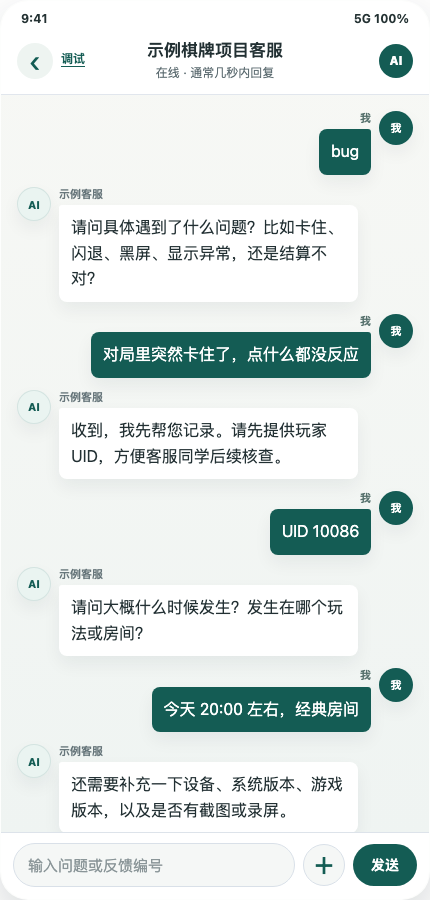
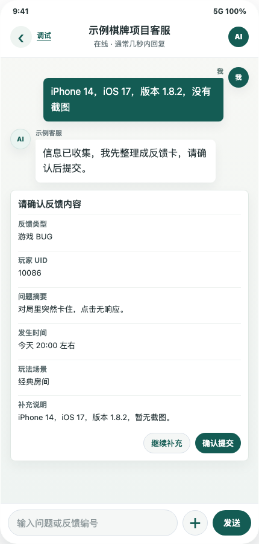
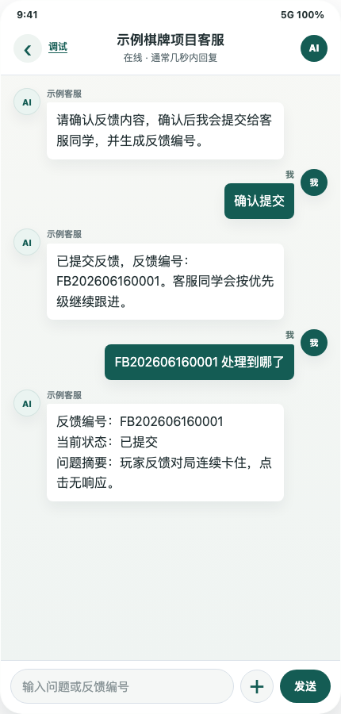
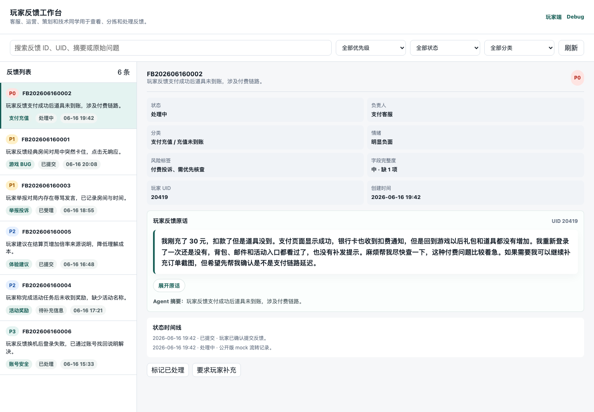

# 游戏智能客服与玩家反馈分析 Agent

一个面向游戏客服场景的 Agent MVP，目标是验证“玩家自然语言反馈 -> Agent 识别追问 -> 结构化工单 -> 运营侧处理视图”的最小闭环。

项目以静态页面形式交付，模拟玩家在游戏内客服入口提交咨询、BUG、充值、举报和建议反馈的过程，并通过本地规则引擎完成意图识别、信息补全、优先级判断和工单结构化。它不是一个完整客服系统，而是一个用于验证产品流程、Agent 策略、反馈字段建模和双端协作方式的可运行原型。

> 公开说明：本仓库是脱敏后的 GitHub 公共版本。所有业务数据、知识库内容、反馈样例和协同系统均为 mock 或 anonymized sample，不连接真实玩家、订单、截图、飞书或生产系统。

## 我的角色与产品价值

我负责本项目的产品场景定义、MVP 范围拆解、核心流程设计、反馈字段建模和 Agent 评测框架设计，并使用 Codex 协作完成可运行原型落地。

项目重点不是搭建完整生产客服系统，而是验证一个 AI 产品经理需要判断的核心问题：在游戏客服场景中，Agent 能否把玩家的自然语言反馈转成运营可处理的结构化信息，并通过追问、分类、优先级判断和状态流转降低人工处理成本。

我在项目中重点设计了三类用户路径：

- 玩家侧：咨询、BUG、充值、举报、建议等反馈入口，以及处理进度查询。
- Agent 侧：意图识别、知识库匹配、缺失字段追问、反馈摘要和优先级判断。
- 运营侧：结构化工单查看、筛选、风险标签、状态流转和处理时间线。

这个项目体现的是我对 AI Agent 产品闭环的理解：Agent 不只是聊天入口，还需要围绕真实业务流程完成输入理解、追问补全、结构化输出、人工协同和评测验证。

## 项目定位

游戏客服中大量玩家反馈并不是标准工单，而是“卡了”“不到账”“有人骂我”“活动在哪”这类短句、模糊词和上下文缺失信息。这个 MVP 关注的问题是：如何让 Agent 先把玩家表达转成运营可处理的结构化信息，而不是把所有问题直接丢给人工客服。

当前版本重点验证三件事：

- 玩家端能否用更低成本完成咨询、反馈提交和进度查询。
- Agent 能否识别问题方向，并在缺字段时追问关键细节。
- 运营端能否基于玩家原话、关键字段、风险标签和状态流转快速判断优先级。

## 核心能力

- 玩家端：规则咨询、活动答疑、充值/BUG/举报/建议反馈提交、处理进度查询。
- Agent 侧：意图识别、知识库检索、模糊词消歧、关键信息追问、反馈摘要、分类和优先级判断。
- 运营端：反馈列表、筛选搜索、玩家原话、关键字段、缺失字段、风险标签、状态流转和时间线。
- 协同侧：mock 飞书同步 adapter，展示后续接入协同系统的字段映射和失败重试思路。
- 评测侧：Node.js smoke/evaluation 脚本覆盖主链路、语义分类、玩家端流程和双端数据同步。

## 效果预览

以下截图使用公开版 mock 数据，展示玩家端从模糊问题到结构化反馈，再到运营端处理视图的完整链路。

### 玩家端：逐步追问并补全关键信息

Agent 不直接把 `bug` 当成完整反馈，而是先追问故障现象、玩家 UID、发生时间和玩法场景。



### 玩家端：生成反馈确认卡

玩家补充设备、系统版本和截图情况后，Agent 生成反馈确认卡，供玩家确认提交。



### 玩家端：提交反馈并查询进度

提交后玩家获得反馈编号，并可以用编号查询当前处理状态和问题摘要。



### 产品运营端：结构化工单处理

运营端工作台保留玩家反馈原话，并将反馈转成可筛选、可分派、可流转的处理视图。



## 当前版本边界

这是一个可在静态页面运行的 MVP，当前阶段有意聚焦核心链路验证，暂不把系统扩展成完整生产方案。

- 未接入真实飞书、多维表格、客服系统或线上工单系统。
- 未实现群同步机制，包括 P0 告警、普通问题每日定时同步和日报推送。
- 未扩展到完整客服使用端，目前运营端以反馈查看、筛选和流转原型为主。
- 未接入持续收集真实用户反馈、自动生成周报/月报和沉淀优化建议的闭环。
- UI 以功能验证为先，视觉美化、数据看板和可视化表达仍保留为后续迭代空间。

## 页面入口

当前项目是无需后端的静态 MVP。

| 页面 | 文件 | 用途 |
| --- | --- | --- |
| 玩家端 WebView | [app/player.html](app/player.html) | 玩家咨询、提交反馈、查询进度 |
| 产品运营端工作台 | [app/ops.html](app/ops.html) | 内部查看、筛选、处理和流转反馈 |
| Debug 页 | [app/index.html](app/index.html) | 开发调试完整 Agent 链路 |

核心文件：

- [app/agent-core.js](app/agent-core.js)：意图识别、知识库检索、反馈结构化和状态文本。
- [app/player-app.js](app/player-app.js)：玩家端交互流程。
- [app/ops-app.js](app/ops-app.js)：运营端工作台交互。
- [app/feedback-store.js](app/feedback-store.js)：共享工单存储。
- [app/feishu-adapter.js](app/feishu-adapter.js)：mock 协同同步 adapter。
- [data/knowledge_base/card_game_kb_seed.json](data/knowledge_base/card_game_kb_seed.json)：脱敏示例知识库。

## 本地运行

从项目根目录启动静态服务器：

```bash
python3 -m http.server 5188 --bind 127.0.0.1
```

浏览器访问：

```text
http://127.0.0.1:5188/app/player.html
http://127.0.0.1:5188/app/ops.html
http://127.0.0.1:5188/app/
```

## 验证命令

```bash
node scripts/check_public_release.js
node scripts/smoke_agent.js
node scripts/smoke_pages.js
node scripts/smoke_two_sided.js
node scripts/smoke_player_quick_entry.js
node scripts/smoke_player_flow_tree.js --strict
node scripts/evaluate_agent_mvp.js
```

可选：

```bash
node scripts/smoke_feishu.js
```

## 文档

- [docs/PRD.md](docs/PRD.md)：产品目标、角色、场景和边界。
- [docs/FEEDBACK_SCHEMA.md](docs/FEEDBACK_SCHEMA.md)：反馈字段、状态流转和结构化数据。
- [docs/AGENT_EVALUATION_FRAMEWORK.md](docs/AGENT_EVALUATION_FRAMEWORK.md)：Agent 评测框架。
- [docs/AGENT_EVALUATION_REPORT_20260605.md](docs/AGENT_EVALUATION_REPORT_20260605.md)：自动评测报告。
- [docs/OCR_PIPELINE_SUMMARY.md](docs/OCR_PIPELINE_SUMMARY.md)：OCR 到知识库的公开版流程说明。
- [docs/PUBLIC_DATA_NOTICE.md](docs/PUBLIC_DATA_NOTICE.md)：公开数据与脱敏边界。

## 公开仓库边界

- 不包含原始截图。
- 不包含原始 OCR 明细文件。
- 不包含真实 API key、webhook、token 或生产配置。
- 不包含真实玩家、订单、账号、客服记录或工单系统数据。
- 飞书、多维表格、群通知和告警均为 mock 设计，用于展示后续协同链路的字段和流程思路。

## 后续可扩展方向

1. 协同系统接入：将 mock adapter 替换为真实飞书、多维表格或工单系统；对 P0 问题触发即时群告警，对非 P0 问题按天聚合生成客服/运营日报。
2. 客服与运营工作台扩展：在现有运营端基础上增加客服处理视图、分派机制、SLA 标记、处理备注、升级流转和跨角色协作记录。
3. 持续反馈分析闭环：持续收集玩家反馈和处理结果，自动形成周报/月报，输出高频问题、版本风险、知识库缺口和体验优化建议。
4. Agent 能力增强：引入更稳定的语义识别、可配置追问策略、多项目知识库模板、优先级规则配置和知识库更新建议。
5. 体验与可视化升级：优化玩家端和运营端视觉表现，增加趋势图、问题聚类、处理漏斗、风险分布和版本对比等分析视图。
