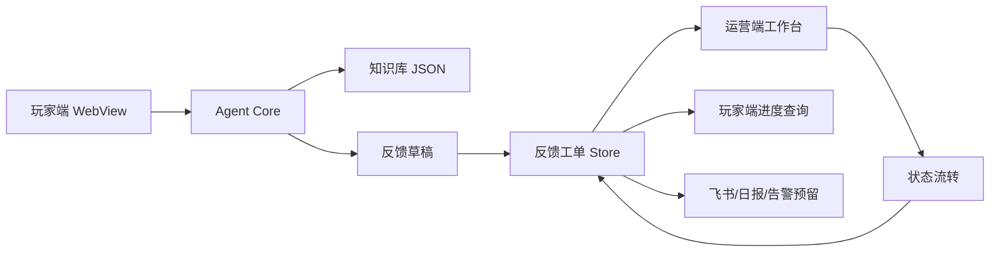

# 双端信息架构：玩家端与产品运营端拆分

更新时间：2026-05-28  
状态：设计文档，暂不进入代码改造  
目标：将当前全功能调试页拆分为面向玩家的客服 WebView 和面向内部团队的反馈工作台，避免把内部处理信息暴露给玩家。

## 1. 当前问题

当前 `app/` 页面将以下能力放在同一界面：

- 玩家聊天与规则问答。
- Agent 意图识别结果。
- 工单列表。
- 状态流转按钮。
- 飞书同步 mock。
- 字段完整度和内部处理时间线。

这个设计适合开发调试和全链路验证，但不适合作为正式产品界面。玩家和内部团队的目标不同，信息权限不同，交互复杂度也不同。

## 2. 拆分原则

| 原则 | 说明 |
| --- | --- |
| 角色目标优先 | 玩家要快速解决问题；运营/客服要高效分拣和处理反馈 |
| 信息最小暴露 | 玩家端不展示内部分类、优先级、负责人、飞书状态和处理时间线 |
| 操作权隔离 | 玩家只能提交和查询自己的反馈；内部端才能流转状态和处理工单 |
| 共享数据对象 | 两端共享同一套反馈对象、知识库对象和状态定义 |
| debug 页保留 | 当前全功能页保留为内部调试页，不作为正式体验 |

## 3. 目标页面

| 页面 | 用户 | 主要目标 | 建议路由 |
| --- | --- | --- | --- |
| 玩家客服 WebView | 玩家 | 咨询、提交反馈、查询进度 | `/app/player.html` |
| 产品运营反馈工作台 | 客服、运营、策划、技术、测试 | 查看、筛选、处理、流转反馈 | `/app/ops.html` |
| 内部调试页 | 开发/测试人员 | 验证完整链路和规则配置 | `/app/index.html` |

## 4. 玩家端保留内容

玩家端只保留玩家需要理解和操作的内容：

- 欢迎语。
- 快捷入口。
- 聊天消息。
- 知识库回答。
- 必要追问。
- 反馈确认卡。
- 提交成功反馈 ID。
- 进度查询。
- 联系人工或继续补充信息入口。

玩家端不展示：

- intent、category、priority 原始识别结果。
- 知识库 ID。
- 工单列表。
- 状态流转按钮。
- 飞书同步状态。
- 内部负责人。
- 字段完整度。
- 内部 timeline。
- mock 调试信息。

## 5. 运营端保留内容

运营端面向内部团队，核心是处理效率：

- 反馈列表。
- 优先级、状态、分类、负责人筛选。
- 搜索反馈 ID、UID、关键词。
- 工单详情。
- 玩家原始问题。
- AI 摘要。
- 玩家反馈原话与关键字段。
- 缺失字段。
- 风险标签。
- 状态流转。
- 处理记录。
- 同步状态或告警状态预留。
- 反馈趋势和日报入口预留。

运营端不需要：

- 玩家式欢迎语。
- 大段聊天式引导。
- 玩家快捷问题入口。
- 面向玩家的话术装饰。

## 6. 共享对象

两端共享以下数据对象：

| 对象 | 用途 |
| --- | --- |
| knowledge item | 玩家端问答检索；运营端查看来源与维护建议 |
| feedback draft | 玩家端反馈确认卡；运营端字段完整度判断 |
| feedback ticket | 运营端处理主对象；玩家端查询进度 |
| status definition | 玩家端展示状态；运营端执行流转 |
| priority rule | 玩家端不直接展示或弱展示；运营端用于排序和告警 |

## 7. 数据流



## 8. 推荐代码拆分

当前不立刻改代码，但后续建议拆成：

```text
app/
  player.html
  ops.html
  index.html
  styles/
    player.css
    ops.css
  shared/
    agent-core.js
    feedback-store.js
    feishu-adapter.js
    ui-formatters.js
  player/
    player-app.js
  ops/
    ops-app.js
```

当前页面已保留为：

```text
app/index.html
```

## 9. Figma Make 前置输入

后续使用 Figma Make 前，应分别给两个界面输入，不要要求一次生成完整系统。

建议顺序：

1. 先生成玩家端 WebView。
2. 再生成运营端反馈工作台。
3. 最后补组件规范和状态流转细节。

玩家端关键词：

```text
mobile game customer support webview, chat, feedback confirmation card, progress query
```

运营端关键词：

```text
internal feedback triage workbench, dense operational dashboard, ticket list, detail panel, status workflow
```

## 10. 后续验收标准

| 验收点 | 通过标准 |
| --- | --- |
| 玩家端纯净 | 玩家看不到内部调试、负责人、飞书状态和状态流转按钮 |
| 运营端高效 | 内部同学能快速筛选、查看、流转反馈 |
| 数据一致 | 玩家端提交后，运营端能看到同一条反馈 |
| 状态回读 | 运营端状态变化后，玩家端进度查询能读到更新 |
| debug 保留 | 内部仍可通过 debug 页验证完整链路 |
