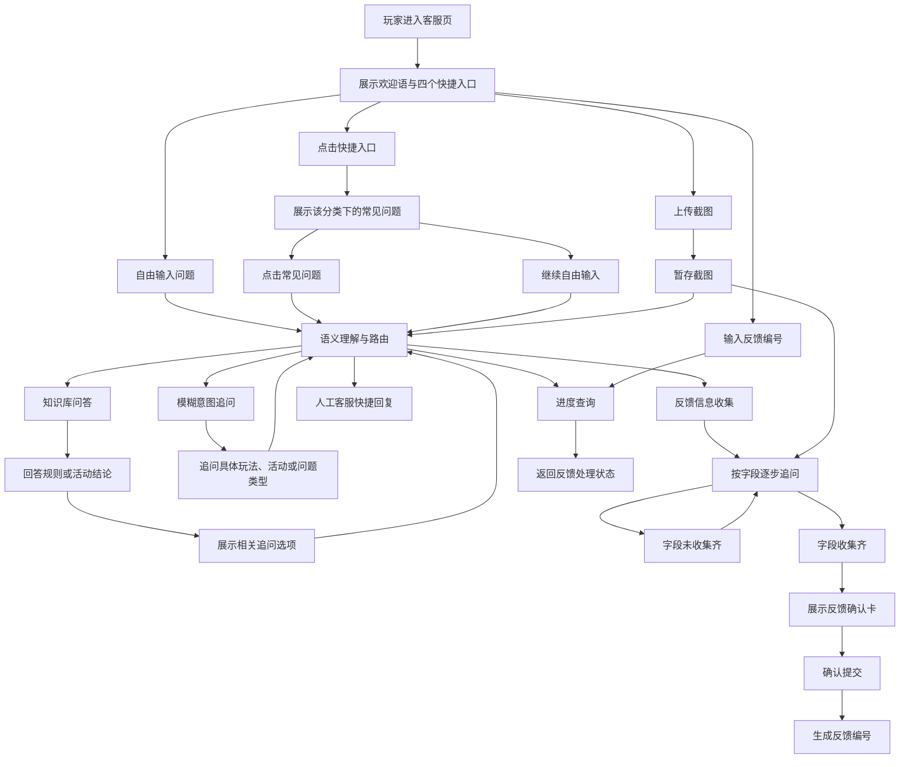
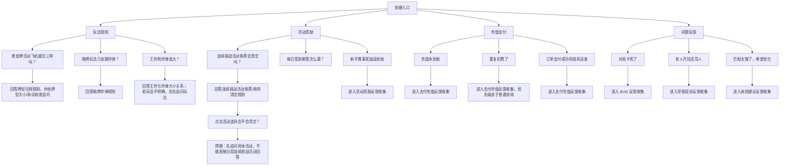
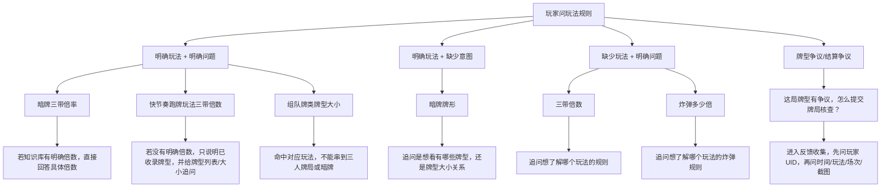
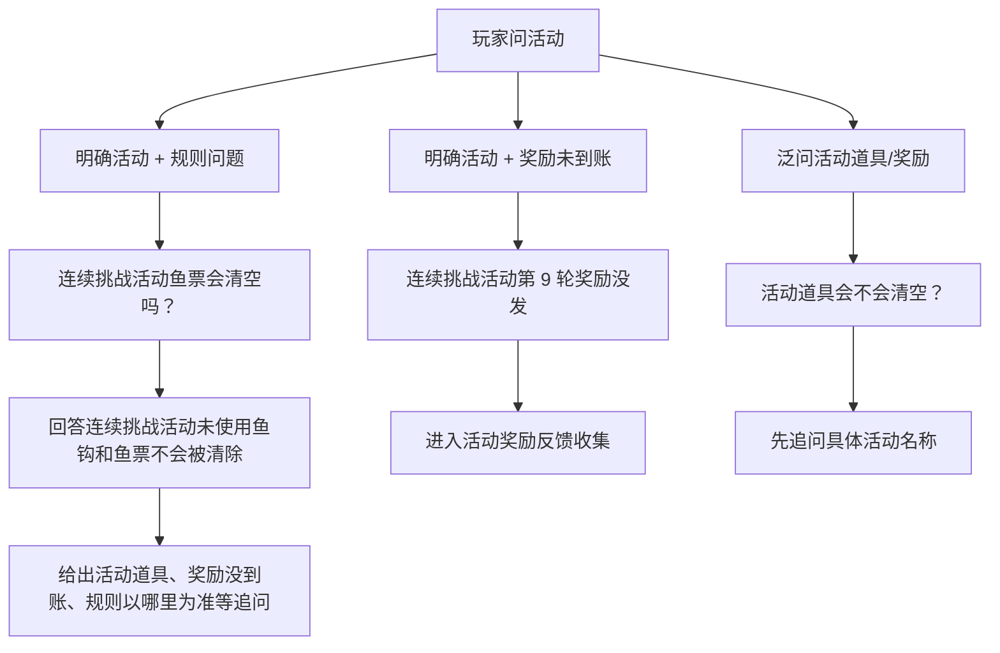
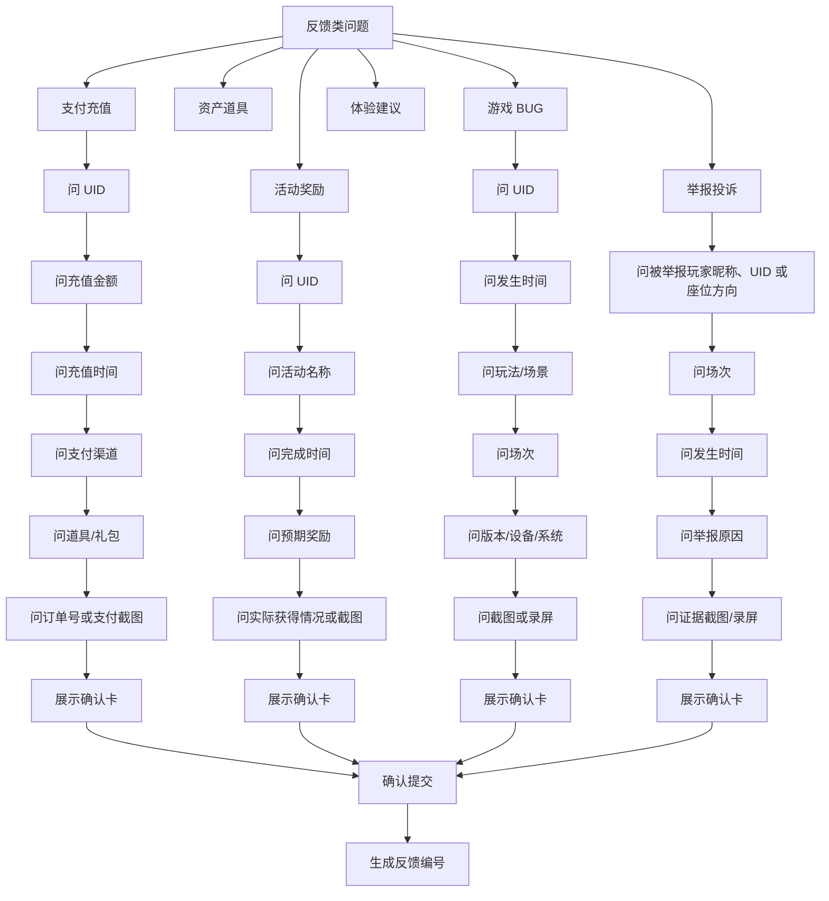
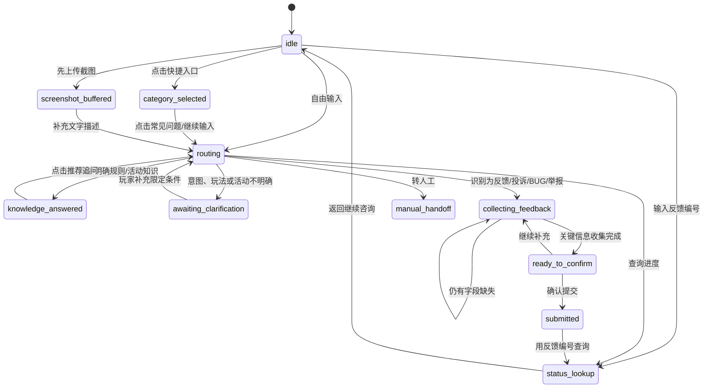

# 玩家端流程测试树

更新时间：2026-06-09  
适用页面：`/app/player.html`  
当前用途：把玩家端客服流程整理成可视化测试树，降低人工自测成本，并为后续自动化用例提供索引。

## 1. 测试目标

本文件用于验收玩家端是否符合“手机 WebView 智能客服”的核心体验：

- 玩家能从快捷入口或自由输入进入正确流程。
- 规则/活动类问题能得到简洁准确的回答。
- 模糊问题能被追问，而不是误答或强行建单。
- 反馈类问题能分步骤收集信息，信息齐全后再出现反馈确认卡。
- 推荐问题点击后能保持上下文，不串到错误玩法或活动。
- 页面文案保持客服口吻，不暴露英文内部字段。

## 2. 总流程树

## 3. 快捷入口测试树

### 当前待修复验收点

| ID | 路径 | 当前问题 | 预期 |
| --- | --- | --- | --- |
| PFT-001 | 充值支付 -> 常见问题 | 常见问题“我充值了 30 元但没到账”过于具体 | 改为“充值未到账”，降低选择门槛 |
| PFT-002 | 反馈确认卡 | 卡片仍展示“还缺少”栏位 | 信息收集齐后不展示“还缺少”；未收集齐时不弹确认卡 |
| PFT-003 | 活动奖励 -> 连续挑战活动 -> 活动道具会不会清空 | 追问选项点击后直接沿用连续挑战活动知识回答 | 如果追问语未带活动名称，应先问“请问您想咨询哪个活动？” |

## 4. 玩法规则测试树

### 玩法规则验收要点

| 检查点 | 合格标准 |
| --- | --- |
| 明确玩法的问题 | 不再重复问玩法，直接检索对应知识 |
| 模糊牌型问题 | 不乱答，先追问玩法或意图 |
| 牌型倍率问题 | 有明确倍数则直接答；没有明确倍数则说明可查的替代内容 |
| 玩法隔离 | 暗牌、快节奏跑牌玩法、组队牌类、三人牌局之间不能串规则 |
| 争议类问题 | 不当作普通规则问答，进入反馈收集 |

## 5. 活动规则测试树

### 活动规则验收要点

| 检查点 | 合格标准 |
| --- | --- |
| 明确活动 | 可以直接回答活动规则 |
| 未明确活动 | 不能默认套用上一个活动，先追问活动名称 |
| 奖励没到账 | 进入反馈收集，不承诺补发 |
| 边界表达 | 提醒以游戏内页面和客服核查结果为准 |

## 6. 反馈收集测试树

### 反馈收集验收要点

| 检查点 | 合格标准 |
| --- | --- |
| 分步骤追问 | 一次只问一个关键字段，避免玩家漏填 |
| 截图处理 | 玩家过程中上传的图片计入反馈截图 |
| 确认卡时机 | 关键信息收集完成后再弹确认卡 |
| 确认卡字段 | 只展示中文字段，不展示英文 key，不展示“还缺少” |
| 提交结果 | 生成反馈编号，可用于查询进度 |

## 7. 自动化用例拆分建议

下一步可以把本文件拆成三类自动化检查：

| 用例组 | 覆盖内容 | 建议文件 |
| --- | --- | --- |
| 快捷入口树 | 四个入口、常见问题文案、点击后的路由 | `scripts/smoke_player_flow_tree.js` |
| 知识库问答树 | 玩法隔离、活动追问、明确/模糊问题 | `scripts/smoke_knowledge_flow_tree.js` |
| 反馈收集树 | 分步追问、截图、确认卡、反馈编号 | `scripts/smoke_feedback_flow_tree.js` |

优先级建议：

1. 先做快捷入口树，因为它最容易自动化，也直接覆盖当前发现的 PFT-001。
2. 再做活动/玩法知识树，用来防止“上下文串题”和“玩法串规则”。
3. 最后做反馈收集树，因为它涉及多轮状态、截图和确认卡，需要更完整的模拟环境。

## 8. 状态机视图

流程树用于看路径，状态机用于判断“同一句话在不同上下文里为什么应该有不同反应”。玩家端自动化测试建议统一按以下状态判定。

### 状态验收规则

| 状态 | 进入条件 | 必须满足 | 禁止行为 |
| --- | --- | --- | --- |
| `idle` | 页面初始状态 | 展示欢迎语、快捷入口、输入框和上传入口 | 自动弹反馈卡 |
| `category_selected` | 玩家点击四类快捷入口 | 展示该分类下的短问题选项 | 直接替玩家填入过细示例 |
| `routing` | 玩家输入或点击推荐问题 | 根据当前文本和上下文判断路由 | 忽略当前上下文或复用错误上下文 |
| `knowledge_answered` | 命中明确知识库 | 简短回答核心结论，并给相关追问 | 编造未收录规则；跨玩法串规则 |
| `awaiting_clarification` | 玩法、活动、问题类型不明确 | 只追问最关键的限定条件 | 一次问太多；直接默认某个活动/玩法 |
| `collecting_feedback` | 反馈类问题 | 每轮只问一个字段，可接收截图 | 信息未齐就弹确认卡 |
| `ready_to_confirm` | 必填字段已齐 | 展示中文确认卡，可提交或继续补充 | 展示英文 key 或“还缺少” |
| `manual_handoff` | 玩家要求转人工 | 回复人工客服正在接入中 | 继续向玩家索要反馈字段 |
| `status_lookup` | 玩家输入反馈编号 | 返回状态和摘要 | 查不到刚提交反馈 |

## 9. 用例矩阵模板

后续自动化脚本不直接读取 Mermaid 图，而是读取/复刻下面这种矩阵结构。每条用例至少应包含输入、上下文、预期路由和禁止行为。

| 用例 ID | 场景 | 初始状态 | 用户动作 | 预期路由/状态 | 预期回复要点 | 禁止行为 | 当前优先级 |
| --- | --- | --- | --- | --- | --- | --- | --- |
| PFT-001 | 充值快捷入口 | `idle` | 点击“充值支付” | `category_selected` | 常见问题包含“充值未到账” | 出现“我充值了 30 元但没到账”这类过细示例 | P1 |
| PFT-002 | 反馈确认卡 | `ready_to_confirm` | 字段收集完成 | `ready_to_confirm` | 确认卡展示问题类型、摘要、已识别信息 | 展示“还缺少”；展示英文 key | P1 |
| PFT-003 | 活动泛问 | `knowledge_answered` | 点击“活动道具会不会清空？” | `awaiting_clarification` | 先追问活动名称 | 默认沿用“连续挑战活动”直接回答 | P1 |
| PFT-004 | 模糊牌型倍数 | `idle` | 输入“三带倍数” | `awaiting_clarification` | 追问想了解哪个玩法 | 直接返回暗牌或快节奏跑牌玩法答案 | P1 |
| PFT-005 | 明确暗牌倍数 | `idle` | 输入“暗牌三带倍数” | `knowledge_answered` | 回答“暗牌三带是 4 倍” | 回答泛牌型压制规则 | P1 |
| PFT-006 | 明确快节奏跑牌玩法倍数缺口 | `idle` | 输入“快节奏跑牌玩法三带倍数” | `knowledge_answered` | 说明快节奏跑牌玩法包含三带一、三带二，并提供牌型列表/大小追问 | 串到暗牌 4 倍 | P1 |
| PFT-007 | 牌型争议 | `knowledge_answered` | 点击“这局牌型有争议，怎么提交牌局核查？” | `collecting_feedback` | 先问玩家 UID | 继续问牌型大小 | P1 |
| PFT-008 | 上传截图 | `collecting_feedback` | 选择图片 | `collecting_feedback` | 反馈中记录截图 | 截图丢失或要求重复上传 | P2 |

## 10. 回归验收清单

每次改动玩家端后，至少检查：

- [ ] 点击“充值支付”后，常见问题中出现“充值未到账”，不出现过细金额示例。
- [ ] 信息未收集齐时，不弹反馈确认卡。
- [ ] 信息收集齐后，确认卡不展示“还缺少”。
- [ ] 活动泛问“活动道具会不会清空？”时，未带活动名称则先追问活动名称。
- [ ] “连续挑战活动鱼票会清空吗？”能正确回答连续挑战活动规则。
- [ ] “三带倍数”先追问玩法。
- [ ] “暗牌三带倍数”能直接回答暗牌三带倍数。
- [ ] “快节奏跑牌玩法三带倍数”不串到暗牌倍数，能给出已收录牌型和后续可选问题。
- [ ] “这局牌型有争议，怎么提交牌局核查？”进入反馈收集。
- [ ] 点击推荐问题后，高亮停留在被点击的位置。
